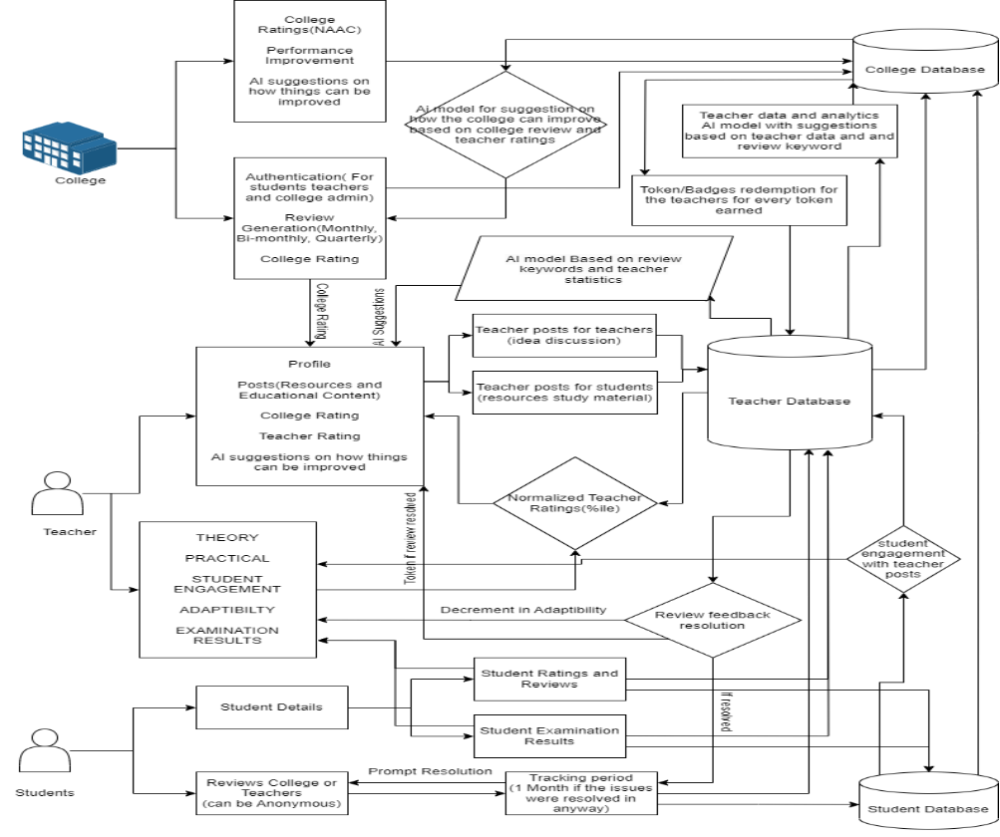

# TPAT - Teacher's Performance Assessment Tool 

## Introduction

A mobile and web-based app that can evaluate teachers using student feedback and exam results, assigning ranks that earn redeemable credits and better job opportunities. Incentives aside, the platform empowers educators to craft courses, share materials, and promotes collaboration, enhancing both teaching quality and continuous professional growth.

## Features
* helps teachers rank themselves amongst their peers
* induces competition and motivation between teachers for better education practices
* helps colleges and universities make informed HR decisions based on realtime data
* standardize teaching practices across all boards and universities

## Techstack
* React
* Express
* Knex 
* Mongoose
* Swagger-ui
* Node
* Postgre
* Docker
* MongoDB
   
## Pre-requisites

* node 20.4.0

## Setup

### Clone the repository


git clone https://github.com/smitjiwani/TPAT.git


### initialize

```
npm install
```

> Use build.sh file for initializing the docker for better developer experience on the server side.

### Client-side

Dev

```
npm run dev
```

Production

```
npm run build
```

you will be able to acesss the frontend at http://localhost:5173/

### Server-side

Use

```
./build.sh
```

> builds the database schema and runs the migrate and seed files.

```
./destroy.sh
```

> destroys the schema and shuts down the docker

or Use the following commands

```
docker compose up -d --build
docker exec -it server npm run migrate
docker exec -it server npm run seed
```

> for  building.

```
docker-compose down
```
> for destroying and shutting down.

you will be able to access the backend at http://localhost:5000/

## block diagram of the proposed architecture for the system

